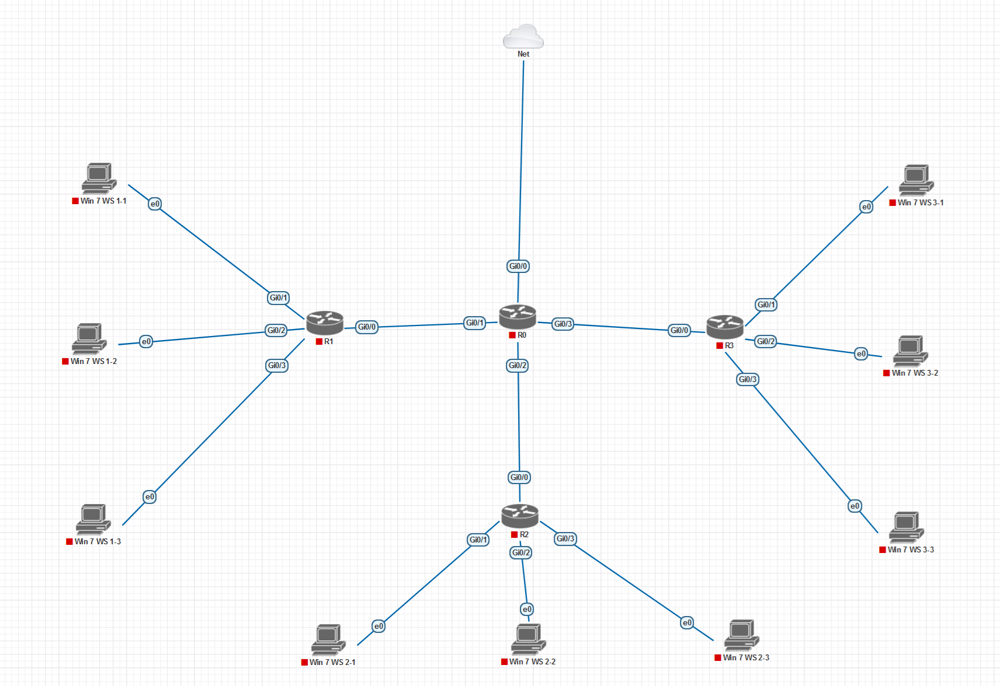

# **Лабораторная работа №1. Настройка операционной системы Cisco IOS**

## **Постановка задачи:**

1. **Построить модель компьютерной сети** со следующей топологией, состоящей из 4 маршрутизаторов и 9 рабочих мест:

2. **Изменение имени маршрутизатора R0**
   - Переключиться в административный режим
   - Перейти в режим конфигурации
   - Установить новое имя маршрутизатора

3. **Настройка интернет-доступа на R0**
   - Настроить интерфейс Gi0/0 для автоматического получения IP-адреса
   - Активировать интерфейс
   - Проверить получение IP-адреса

4. **Настройка DHCP-сервера на R0**
   - Создать исключение для статического IP-адреса
   - Настроить пул адресов для клиентов
   - Указать параметры сети и DNS

5. **Настройка сетевого моста на R0**
   - Активировать режим моста
   - Настроить мостовое соединение для интерфейсов
   - Установить IP-адрес для виртуального интерфейса

6. **Настройка маршрутизаторов R1-R3**
   - Изменить имена устройств
   - Настроить мостовое соединение для всех интерфейсов
   - Активировать получение IP-адреса по DHCP

7. **Настройка DNS-сервера на R0**
   - Настроить перенаправление DNS-запросов
   - Активировать DNS-сервер

8. **Проверка работы сети**
   - Убедиться в корректности сетевых настроек
   - Проверить работу локальной сети
   - Проверить доступ в интернет

9. **Настройка NAT (дополнительно)**
   - Настроить преобразование сетевых адресов
   - Создать access-list
   - Определить внутренние и внешние интерфейсы

10. **Настройка удаленного доступа**
    - Активировать шифрование паролей
    - Настроить доступ через консоль
    - Установить пароль администратора
    - Настроить доступ по Telnet

11. **Сохранение конфигурации**
    - Сохранить настройки в энергонезависимую память