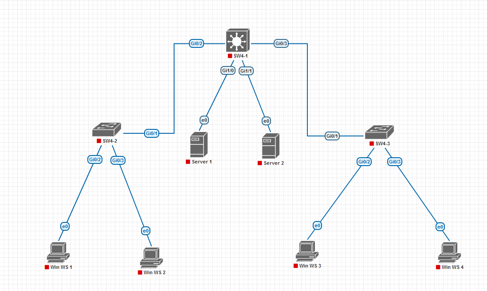

# **Лабораторная работа №2. Настройка VLAN и анализ сетевых атак**

## **Постановка задачи:**

1. **Построить модель компьютерной сети** с указанной топологией (4 коммутатора, 9 рабочих станций)

2. **Настройка VLAN на коммутаторах**
   - На SW4-2 настроить:
     - Gi0/2 и Gi0/3 как access-порты
     - Gi0/1 как trunk-порт (802.1Q)
   - На SW4-3 выполнить аналогичную настройку
   - На SW4-1 настроить:
     - Gi1/0 и Gi1/1 как access-порты
     - Gi0/2 и Gi0/3 как trunk-порты

3. **Настройка IP-адресации и проверка связи**
   - Назначить рабочей станции 1: 192.168.0.3/16
   - Назначить серверу 1: 192.168.0.2/16
   - Проверить связность ping между станциями

4. **Подключение Kali Linux и проверка доступа**
   - Подключить хост Kali к Gi0/0 SW4-1 (access-порт)
   - Назначить IP: 192.168.0.4/16
   - Проверить доступность с рабочей станции 1

5. **Моделирование атаки MAC Spoofing**
   - На Kali Linux:
     - Сменить MAC на адрес сервера 1
     - Запустить Wireshark
   - Проверить перехват ping-пакетов, адресованных 192.168.0.2

6. **Моделирование атаки MAC Flooding**
   - На Kali Linux выполнить: 
   ```bash
   sudo macof -i eth0
   ```
   - Проверить:
     - Задержки/потери ping-пакетов
     - Остановить атаку (Ctrl+C)

7. **Настройка Port Security (базовая защита)**
   - Восстановить оригинальный MAC Kali
   - Настроить на Gi0/0 SW4-1:
     - Активировать Port Security
     - Макс. 1 MAC-адрес
     - Режим shutdown при нарушении
     - Зарегистрировать легитимный MAC
   - Проверить:
     - Доступность хоста Kali
     - Блокировку порта при попытке spoofing
     - Статус Secure-shutdown

8. **Настройка Port Security (расширенная защита)**
   - Восстановить работоспособность порта
   - Настроить на Gi0/0 SW4-1:
     - Макс. 10 MAC-адресов
     - Режим sticky learning
   - Проверить блокировку порта при MAC flooding

## **Требуемые инструменты:**
- Linux
- Kali Linux (для тестирования уязвимостей)
- Wireshark (для анализа трафика)
- Windows 7

