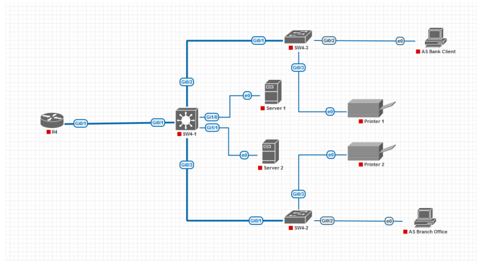

# **Лабораторная работа №3. Защита инфраструктуры коммутации**

## **Постановка задачи:**

1. **Построить модель компьютерной сети со следующей топологией.**:

2. **Настроить виртуальные локальные сети согласно следующей легенде.**

| Идентификатор VLAN | Назначение VLAN          | IP-адреса узлов VLAN                     |
|:------------------:|:------------------------:|:----------------------------------------:|
| VLAN 10            | АС Инфраструктура        | Адрес маршрутизатора - 10.194.4.1        |
|                    |                          | Сервер 1 - 10.194.4.11                   |
|                    |                          | Сервер 2 - 10.194.4.12                   |
| VLAN 20            | АС Филиал                | Адрес маршрутизатора - 10.194.4.65       |
|                    |                          | Рабочая станция филиала - 10.194.4.66    |
| VLAN 30            | АС Клиент-Банк           | Адрес маршрутизатора - 10.194.4.129      |
|                    |                          | Клиент - 10.194.4.130                    |
| VLAN 40            | МФУ и принтеры           | Адрес маршрутизатора - 10.194.4.193      |
|                    |                          | Принтер 1 - 10.194.4.194                 |
|                    |                          | Принтер 2 - 10.194.4.195                 |
| VLAN 700           | Отключенные порты        |                                          |
| VLAN 701           | Собственная VLAN         |                                          |

   - **На коммутаторе SW4-3 - отключить протокол VTP и создать VLAN с идентификаторами 30, 40, 700 и 701.**

   - **На коммутаторе SW4-3 настроить магистральные порты и порты доступа.**

   - **Настроить неиспользуемые порты коммутатора SW4-3.**

   - **Выполнить аналогичные настройки на коммутаторе SW4-2, с учётом того, что через него проходит трафик VLAN с номерами 20 и 40.**

   - **Выполнить настройку коммутатора SW4-1: настроить магистральные порты для связи с коммутаторами SW4-2 и SW4-1 и маршрутизатором R4 и порты доступа для серверов.**

   - **На маршрутизаторе R4 настроить маршрутизацию между VLAN с помощью субинтерфейсов.**

3. **Проверить доступность серверов из рабочих станций. Убедиться, что кадры тегируются соответствующим образом. Для этого на коммутаторе SW4-1 настроить зеркалирование траффика с порта Gi0/1 на порт Gi0/0.**

   - **Подключить к порту Gi0/0 коммутатора SW4-1 узел с Kali Linux и с помощью анализатора траффика Wireshark изучить формат кадров и определить значения тегов VLAN.**

4. **Реализовать атаку VLAN hopping**.

- **Для возможности её реализации отключить зеркалирование траффика и перевести порт Gi0/0 коммутатора SW4-1 в режим dynamic desirable.**

- **Попытаться с узла Kali Linux получить доступ к одному из серверов и убедиться, что это невозможно.**

- **С помощью утилиты yersinia выполнить атаку: в графическом интерфейсе нажать кнопку Launch attack, выбрать вкладку DTP и установить радиокнопку enable trunking.**

- **На узле Kali Linux поднять сетевой интерфейс для VLAN следующей последовательностью команд в терминале.**

- **С помощью команды ping убедиться, что доступ к VLAN 10 стал возможным.**