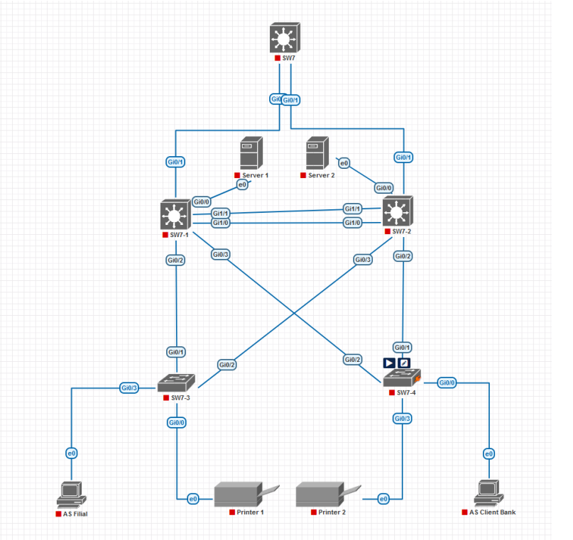
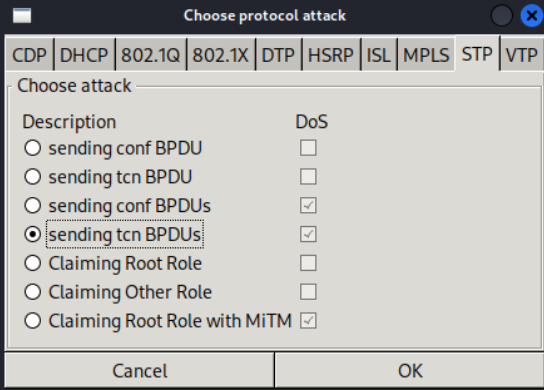
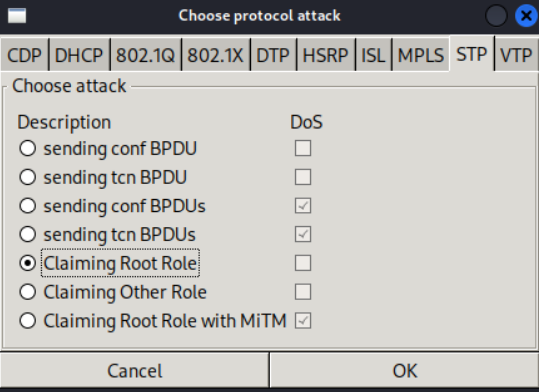

# **Лабораторная работа №4. Защита ЛВС от петель на канальном уровне**

## **Постановка задачи:**

1. **Построить модель компьютерной сети со следующей топологией.**:

2. **Настроить виртуальные локальные сети согласно следующей легенде.**

| Идентификатор VLAN | Назначение VLAN      | IP-адреса узлов VLAN                     |
|--------------------|----------------------|------------------------------------------|
| VLAN 10            | АС Инфраструктура    | Адрес маршрутизатора - 10.194.7.1        |
|                    |                      | Сервер 1 - 10.194.7.11                   |
|                    |                      | Сервер 2 - 10.194.7.12                   |
|--------------------|----------------------|------------------------------------------|
| VLAN 20            | АС Филиал            | Адрес маршрутизатора - 10.194.7.65       |
|                    |                      | Рабочая станция филиала - 10.194.7.66    |
|--------------------|----------------------|------------------------------------------|
| VLAN 30            | АС Клиент-Банк       | Адрес маршрутизатора - 10.194.7.129      |
|                    |                      | Клиент - 10.194.7.130                    |
|--------------------|----------------------|------------------------------------------|
| VLAN 40            | МФУ и принтеры       | Адрес маршрутизатора - 10.194.7.193      |
|                    |                      | Принтер 1 - 10.194.7.194                 |
|                    |                      | Принтер 2 - 10.194.7.195                 |
|--------------------|----------------------|------------------------------------------|
| VLAN 701           | Собственная VLAN     |                                          |
|--------------------|----------------------|------------------------------------------|

2.1. **На коммутаторе SW7 создать VLAN и настроить маршрутизацию.**

2.2. **На коммутаторе SW7-1 создать VLAN (как на коммутаторе SW7, но виртуальные интерфейсы VLAN не добавлять!), порт Gi0/0 настроить как порт доступа для VLAN 10, порты Gi0/1, Gi0/2, Gi0/3, Gi1/0, Gi1/1 — как магистральные порты. Аналогичные настройки выполнить для коммутатора SW7-2.**

2.3. **На коммутаторах SW7-3 и SW7-4 создать VLAN (как на коммутаторе SW7, но виртуальные интерфейсы VLAN не добавлять!), порты Gi0/1 и Gi0/2 настроить как магистральные, порты Gi0/0 и Gi0/3 настроить как порты доступа (для коммутатора SW7-3 — порт Gi0/3 для VLAN 20, порт Gi0/0 — для VLAN 40, для коммутатора SW7-4 — порт Gi0/3 для VLAN 40, порт Gi0/0 — для VLAN 30).**

3. **На коммутаторе SW-7 активировать протокол Rapid-PVST.**

4. **Настроить между коммутаторами SW7-1 и SW7-2 агрегирование двух каналов передачи данных по технологии Etherchannel.**

5. **На коммутаторе SW7-1 настроить протокол Rapid-PVST и задать наивысший приоритет коммутатора, обеспечив ему роль корневого моста в указанных VLAN.**

6. **На коммутаторе SW7-2 настроить протокол Rapid-PVST и задать наивысший приоритет коммутатора, обеспечив ему роль корневого моста в указанных VLAN в случае выхода из строя коммутатора SW7-1.**

7. **На коммутаторах SW7-1 и SW7-2 настроить механизм Root Guard.**

8. **На коммутаторах SW7-3 и SW7-4 настроить протокол Rapid-PVST.**

9. **На портах доступа коммутаторов SW7-3 и SW7-4 настроить протокол STP в режиме portfast, включить механизмы защиты BPDU Guard.**

10. **Проверить доступность сервера 1 из рабочей станции филиала после настройки сети, а также при следующих неисправностях:**
  1) Отключение порта Gi0/1 коммутатора SW7
  2) Отключение порта Gi0/1 коммутатора SW7-1
  3) Отключение порта Gi0/1 коммутатора SW7-3

11. **Реализовать DoS-атаку типа TCN Flood, подключив узел с Kali Linux к порту Gi1/0 коммутатора SW7-3 (для чего настроить этот порт как порт доступа к определённой VLAN). В утилите yersinia выбрать во вкладке STP атаку sending tcn BPDUs**

11.1. **Убедиться, что пакеты данных, отправленные с филиала на сервер 1 либо доходят с большой задержкой, либо не доходят вовсе.**

12. **Реализовать атаку типа BPDU Spoofing, сделав так, чтобы узел с Kali Linux получил роль корневого коммутатора. Для этого добавить в Kali Linux второй Ethernet-разъём, который подключить к порту Gi1/2 коммутатора SW7-1 (для чего настроить этот порт как порт доступа к определённой VLAN), после чего объединить данные интерфейсы в сетевой мост. В утилите yersinia выбрать во вкладке STP атаку Claiming Root Role.**

12.1. **C помощью анализатора траффика Wireshark убедиться,что пакеты данных, отправленные с филиала на сервер 1,перехватываются узлом с Kali Linux.**

13. **На портах коммутаторов SW7-1 и SW7-3 активировать функцию BPDU Guard, после чего проверить, что атаки нейтрализованы и срабатывает функция защиты, которая отключает эти порты.**