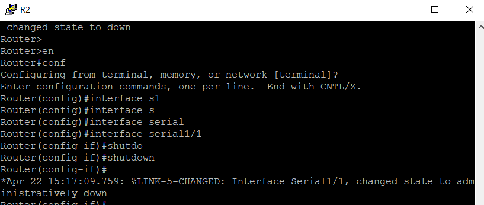
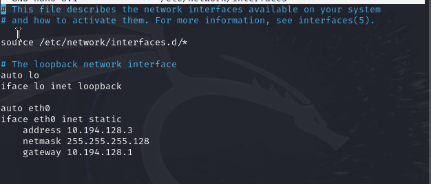

# **Лабораторная работа №5. Защита инфраструктуры маршрутизации.**

# **Решение**

1. Построить модель компьютерной сети не составит труда. Надеюсь, что все могут добавить узлы

2. Для настройки коммутации кадров Frame Relay на соответствующих устройствах по правилам выполним следующие команды:

Для FR1:

```bash
configure terminal
interface Serial1/0
encapsulation frame-relay
frame-relay intf-type dce
frame-relay route 102 interface Serial1/1 201
frame-relay route 103 interface Serial1/2 301
exit
interface Serial1/1
encapsulation frame-relay
frame-relay intf-type dce
frame-relay route 201 interface Serial1/0 102
frame-relay route 203 interface Serial1/2 302
exit
interface Serial1/2
encapsulation frame-relay
frame-relay intf-type dce
frame-relay route 301 interface Serial1/0 103
frame-relay route 302 interface Serial1/1 203
exit
end
```

Для FR2:

```bash
configure terminal
interface Serial1/0
encapsulation frame-relay
frame-relay intf-type dce
frame-relay route 204 interface Serial1/2 402
exit
interface Serial1/1
encapsulation frame-relay
frame-relay intf-type dce
frame-relay route 305 interface Serial1/3 503
exit
interface Serial1/2
encapsulation frame-relay
frame-relay intf-type dce
frame-relay route 402 interface Serial1/0 204
exit
interface Serial1/3
encapsulation frame-relay
frame-relay intf-type dce
frame-relay route 503 interface Serial1/1 305
exit
end
```

3. Чтобы на маршрутизаторах R1-R7 выполнить настройку сетевых интерфейсов и настройку протокола динамической маршрутизации
OSPF согласно таблицам нужно выполнить следующие команды:

Для маршрутизатора R7:

```bash
configure terminal
interface Serial1/0
description Link to R4
ip address 192.168.100.26 255.255.255.252
exit
interface Loopback0
description Loopback interface
ip address 192.168.0.7 255.255.255.255
exit
interface fastEthernet0/0
ip address 10.194.7.1 255.255.255.0
exit
router ospf 10
log-adjacency-changes
area 120 stub
network 0.0.0.0 255.255.255.255 area 120
exit
end
```

Для маршрутизатора R6:

```bash
configure terminal
interface Serial1/0
ip address 192.168.100.42 255.255.255.252
exit
interface Loopback0
description Loopback interface
ip address 192.168.0.6 255.255.255.255
exit
interface fastEthernet0/0
ip address 10.194.6.1 255.255.255.0
exit
router ospf 10
log-adjacency-changes
area 120 stub
network 0.0.0.0 255.255.255.255 area 120
exit
end
```
Для маршрутизатора R5:

```bash
configure terminal
interface Serial1/0
ip address 192.168.100.22 255.255.255.252
exit
interface Serial1/1
ip address 192.168.100.34 255.255.255.252
exit
interface Serial1/2
ip address 192.168.100.41 255.255.255.252
exit
interface Loopback0
description Loopback interface
ip address 192.168.0.5 255.255.255.255
exit
interface fastEthernet0/0
ip address 10.194.5.1 255.255.255.0
exit
router ospf 10
log-adjacency-changes
area 120 stub
network 192.168.100.0 0.0.0.255 area 120
network 10.194.0.0 0.0.255.255 area 120
network 192.168.0.5 0.0.0.0 area 120
exit
end
```

Для маршрутизатора R4:

```bash
configure terminal
interface Serial1/0
encapsulation frame-relay
description Frame Relay Link to R2
ip address 192.168.100.38 255.255.255.252
ip ospf network point-to-point
exit
interface Serial1/1
description Link to R3
ip address 192.168.100.18 255.255.255.252
exit
interface Serial1/2
description Link to R7
ip address 192.168.100.25 255.255.255.252
clock rate 128000
exit
interface Loopback0
description Loopback interface
ip address 192.168.0.4 255.255.255.255
exit
interface fastEthernet0/0
ip address 10.194.4.1 255.255.255.0
exit
router ospf 10
log-adjacency-changes
area 120 stub
network 192.168.100.0 0.0.0.255 area 120
network 10.194.0.0 0.0.255.255 area 120
network 192.168.0.4 0.0.0.0 area 120
exit
end
```

Для маршрутизатора R3:

```bash
configure terminal
interface Serial1/0
encapsulation frame-relay
description Frame Relay Link to R1
ip address 192.168.100.3 255.255.255.248
ip ospf network broadcast
ip ospf priority 10
exit
interface Serial1/1
encapsulation frame-relay
description Frame Relay Link to R5
ip address 192.168.100.21 255.255.255.252
ip ospf network point-to-point
exit
interface Serial1/2
description Link to R4
ip address 192.168.100.17 255.255.255.252
clock rate 128000
exit
interface Loopback0
description Loopback interface
ip address 192.168.0.3 255.255.255.255
exit
router ospf 10
log-adjacency-changes
area 120 stub no-summary
network 192.168.100.17 0.0.0.0 area 120
network 192.168.100.21 0.0.0.0 area 120
network 192.168.0.3 0.0.0.0 area 120
network 192.168.100.3 0.0.0.0 area 0
exit
end
```

Для маршрутизатора R2:

```bash
configure terminal
interface Serial1/0
ip address 192.168.100.2 255.255.255.248
exit
interface Serial1/1
ip address 192.168.100.37 255.255.255.252
exit
interface Serial1/2
ip address 192.168.100.33 255.255.255.252
exit
interface Loopback0
description Loopback interface
ip address 192.168.0.2 255.255.255.255
exit
router ospf 10
log-adjacency-changes
network 192.168.100.33 0.0.0.0 area 120
network 192.168.100.37 0.0.0.0 area 120
network 192.168.0.2 0.0.0.0 area 120
network 192.168.100.2 0.0.0.0 area 0
exit
end
```

Для маршрутизатора R1:

```bash
configure terminal
interface Serial1/0
encapsulation frame-relay
description Frame Relay Link to R2, R3
ip address 192.168.100.1 255.255.255.248
ip ospf network broadcast
ip ospf priority 0
clock rate 128000
exit
interface Loopback0
description Loopback interface
ip address 192.168.0.1 255.255.255.255
exit
interface fastEthernet0/0
ip address 10.194.128.1 255.255.255.128
exit
router ospf 10
log-adjacency-changes
network 192.168.100.0 0.0.0.255 area 0
network 192.168.0.1 0.0.0.0 area 0
network 10.194.0.0 0.0.255.255 area 0
exit
end
```

4. Подключение сервера и рабочей станции не составит труда. Для задания сетевых конфигураций необходимо выполнить следующие действия:

---

Для рабочей станции под управлением Windows 7:
 - Перейти в Панель управления\Сеть и Интернет\Сетевые подключения
 - Выбрать "Подключение по локальной сети"
 - Выбрать свойства
 - Нажать на свойства пункта "Протокол Интернета версии 4"
 - Нажать радиокнопку "Использовать следующий IP-адрес"

 Ввести соответствующий IP-адрес, шлюз и маску подсети

---

Для сервера:
 - Открыть терминал
 - Открыть файл конфигурации интерфейсов с помощью команды:
 ```bash
 sudo nano /etc/netwrok/interfaces
 ```
 - Ввести параметры для сервера:
 ```bash
auto ens3
iface ens3 inet static
address 10.194.7.2
netmask 255. 255.255.0
gateway 10.194.7.1
 ```
- Перезапустить networking.service с помощью команды:
```bash
sudo systemctl restart networking.service
```
---

- Проверить доступность сервера из рабочей станции, в том числе и при разрыве некоторых каналов связи можно выполнить так:

 - На роутере (например R2) отключить нужный интерфейс (Для  R2 s1/1) с помощью команды:
```bash
en
conf t
interface serial1/1
shutdown
```



 - После этого пропинговать с рабочей станции до сервера.

5. Подключить узел с дистрибутивом Kali Linux очень легко. Для задания сетевых конфигураций необходимо выполнить следующие действия:

- Зайти в настройки интерфейсов, используя следующую команду:

```bash
sudo nano /etc/netwrok/interfaces
```

- В файле конфигурации добавить следующее:

```bash
auto etho
iface eth0 inet static
    address 10.194. 128.3
    netmask 255.255.255.128
    gateway 10.194.128.1
```



- После внесения изменений в файл конфигурации нужно обновить сетевого демона. Для этого выполним следующую команду:

```bash
sudo systemctl restart networking.service
```

- Установить frr с помощью следующих команд:

```bash
sudo apt update
sudo apt install frr -y
```

- Включим работу демонов ospfd и staticd, изменив файл конфигурации **/etc/frr/daemons**, открыв его через команду:

```bash
sudo nano /etc/frr/daemons
```

- Отредактировать:
- ospfd=yes
- staticd=yes

- Сохранить и выйти.

- Разрешить форвардинг трафика командой:

```bash
sudo sysctl -w net.ipv4.ip_forward=1
```

- Запустить демон frr командой:

```bash
systemctl start frr
```

- Запустить панель управления виртуальным маршрутизатором с помощью команды:

```bash
sudo vtysh
```

В данной панели управления объявить сеть и задать минимальную стоимость:

```bash
en
conf t
router ospf
network 10.194.128.3/32 area 0
redistribute static metric 0
```

- Объявить статический маршрут:
```bash
ip route 10.194.128.2/32 eth0
```

- На маршрутизаторе R1 проверить с помощью команды **show ip route**, что появился новый маршрут к узлу 10.194.128.2 через узел 10.194.128.3.


- Выполнить команду ping с рабочей станции к серверу и проверить с помощью Wireshark, что ответы от сервера проходят через узел с Kali Linux.

6. Для выполнения данной задачи нужно выполнить следующие команды на роутерах (пароль: password):

Для R1:

```bash
configure terminal
router ospf 10
passive-interface default
no passive-interface Serial1/0
exit
interface Serial1/0
ip ospf authentication message-digest
ip ospf message-digest-key 10 md5 password
exit
end
```

Для R2:

```bash
configure terminal
router ospf 10
passive-interface default
no passive-interface Serial1/0
no passive-interface Serial1/1
no passive-interface Serial1/2
exit
interface Serial1/0
ip ospf authentication message-digest
ip ospf message-digest-key 10 md5 password
exit
interface Serial1/1
ip ospf authentication message-digest
ip ospf message-digest-key 10 md5 password
exit
interface Serial1/2
ip ospf authentication message-digest
ip ospf message-digest-key 10 md5 password
exit
end
```

Для R3:

```bash
configure terminal
router ospf 10
passive-interface default
no passive-interface Serial1/0
no passive-interface Serial1/1
no passive-interface Serial1/2
exit
interface Serial1/0
ip ospf authentication message-digest
ip ospf message-digest-key 10 md5 password
exit
interface Serial1/1
ip ospf authentication message-digest
ip ospf message-digest-key 10 md5 password
exit
interface Serial1/2
ip ospf authentication message-digest
ip ospf message-digest-key 10 md5 password
exit
end
```

Для R4:

```bash
configure terminal
router ospf 10
passive-interface default
no passive-interface Serial1/0
no passive-interface Serial1/1
no passive-interface Serial1/2
exit
interface Serial1/0
ip ospf authentication message-digest
ip ospf message-digest-key 10 md5 password
exit
interface Serial1/1
ip ospf authentication message-digest
ip ospf message-digest-key 10 md5 password
exit
interface Serial1/2
ip ospf authentication message-digest
ip ospf message-digest-key 10 md5 password
exit
end
```

Для R5:
```bash
configure terminal
router ospf 10
passive-interface default
no passive-interface Serial1/0
no passive-interface Serial1/1
no passive-interface Serial1/2
exit
interface Serial1/0
ip ospf authentication message-digest
ip ospf message-digest-key 10 md5 password
exit
interface Serial1/1
ip ospf authentication message-digest
ip ospf message-digest-key 10 md5 password
exit
interface Serial1/2
ip ospf authentication message-digest
ip ospf message-digest-key 10 md5 password
exit
end
```

Для  R6:
```bash
configure terminal
router ospf 10
passive-interface default
no passive-interface Serial1/0
exit
interface Serial1/0
ip ospf authentication message-digest
ip ospf message-digest-key 10 md5 password
exit
end
```

Для  R7:
```bash
configure terminal
router ospf 10
passive-interface default
no passive-interface Serial1/0
exit
interface Serial1/0
ip ospf authentication message-digest
ip ospf message-digest-key 10 md5 password
exit
end
```

7. Действия аналогичны п.6. После ввода канала пропинговать и проверить на роутере R1 путь.