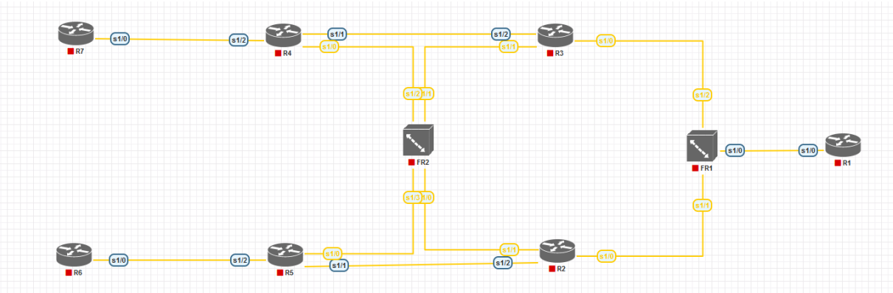
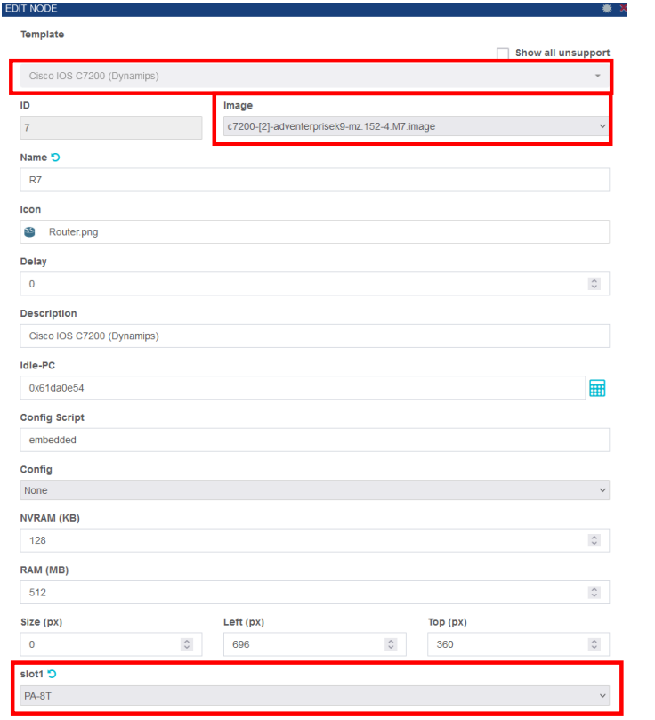
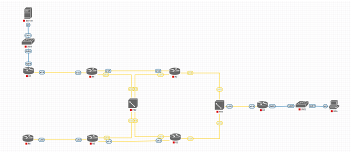
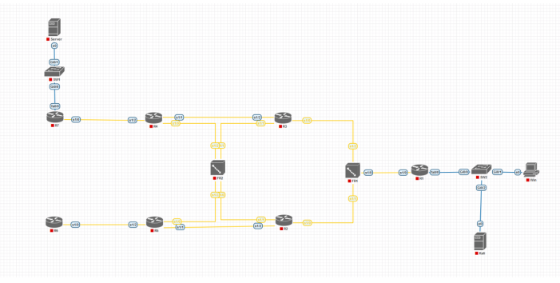

# **Лабораторная работа №5. Защита инфраструктуры маршрутизации.**

## **Постановка задачи:**

1. **Построить модель компьютерной сети со следующей топологией:**

  - Для всех устройств, изображенных на рисунке выше, использовать образ Cisco IOS dynamips и в слот 1 поместить карту расширения PA-8T

2. **Настроить коммутацию кадров Frame Relay на соответствующих устройствах по следующим правилам:**

FR1:

| Соединение | Порт 1 | Порт 2 |
|------------|--------|--------|
| R1 - R3    | 103    | 301    |
| R1 - R2    | 102    | 201    |
| R2 - R3    | 203    | 302    |

FR2:

| Соединение | Порт 1 | Порт 2 |
|------------|--------|--------|
| R2 - R4    | 204    | 402    |
| R3 - R5    | 305    | 503    |

3. **На маршрутизаторах R1-R7 выполнить настройку сетевых интерфейсов и настройку протокола динамической маршрутизации OSPF согласно следующей схеме:**

Параметры сетевых интерфейсов:

| Маршрутизатор | Интерфейс        | IP-адрес          | Маска подсети      |
|---------------|------------------|-------------------|--------------------|
| R1            | Serial1/0        | 192.168.100.1     | 255.255.255.248    |
|               | Loopback0        | 192.168.0.1       | 255.255.255.255    |
|               | fastEthernet0/0  | 10.194.128.1      | 255.255.255.128    |
| R2            | Serial1/0        | 192.168.100.2     | 255.255.255.248    |
|               | Serial1/1        | 192.168.100.37    | 255.255.255.252    |
|               | Serial1/2        | 192.168.100.33    | 255.255.255.252    |
|               | Loopback0        | 192.168.0.2       | 255.255.255.255    |
| R3            | Serial1/0        | 192.168.100.3     | 255.255.255.248    |
|               | Serial1/1        | 192.168.100.21    | 255.255.255.252    |
|               | Serial1/2        | 192.168.100.17    | 255.255.255.252    |
|               | Loopback0        | 192.168.0.3       | 255.255.255.255    |
| R4            | Serial1/0        | 192.168.100.38    | 255.255.255.252    |
|               | Serial1/1        | 192.168.100.18    | 255.255.255.252    |
|               | Serial1/2        | 192.168.100.25    | 255.255.255.252    |
|               | Loopback0        | 192.168.0.4       | 255.255.255.255    |
|               | fastEthernet0/0  | 10.194.4.1        | 255.255.255.0      |
| R5            | Serial1/0        | 192.168.100.22    | 255.255.255.252    |
|               | Serial1/1        | 192.168.100.34    | 255.255.255.252    |
|               | Serial1/2        | 192.168.100.41    | 255.255.255.252    |
|               | Loopback0        | 192.168.0.5       | 255.255.255.255    |
|               | fastEthernet0/0  | 10.194.5.1        | 255.255.255.0      |
| R6            | Serial1/0        | 192.168.100.42    | 255.255.255.252    |
|               | Loopback0        | 192.168.0.6       | 255.255.255.255    |
|               | fastEthernet0/0  | 10.194.6.1        | 255.255.255.0      |
| R7            | Serial1/0        | 192.168.100.26    | 255.255.255.252    |
|               | Loopback0        | 192.168.0.7       | 255.255.255.255    |
|               | fastEthernet0/0  | 10.194.7.1        | 255.255.255.0      |

Параметры протокола OSPF:

| Маршрутизатор | Анонсируемая сеть   | Шаблонная маска    | Зона |
|---------------|---------------------|--------------------|------|
| R1            | 192.168.100.0       | 0.0.0.255          | 0    |
|               | 192.168.0.1         | 0.0.0.0            | 0    |
|               | 10.194.0.0          | 0.0.255.255        | 0    |
| R2            | 192.168.100.33      | 0.0.0.0            | 120  |
|               | 192.168.100.37      | 0.0.0.0            | 120  |
|               | 192.168.0.2         | 0.0.0.0            | 120  |
|               | 192.168.100.2       | 0.0.0.0            | 0    |
| R3            | 192.168.100.17      | 0.0.0.0            | 120  |
|               | 192.168.100.21      | 0.0.0.0            | 120  |
|               | 192.168.0.3         | 0.0.0.0            | 120  |
|               | 192.168.100.3       | 0.0.0.0            | 0    |
| R4            | 192.168.100.0       | 0.0.0.255          | 120  |
|               | 192.168.0.4         | 0.0.0.0            | 120  |
|               | 10.194.0.0          | 0.0.255.255        | 120  |
| R5            | 192.168.100.0       | 0.0.0.255          | 120  |
|               | 192.168.0.5         | 0.0.0.0            | 120  |
|               | 10.194.0.0          | 0.0.255.255        | 120  |
| R6            | 0.0.0.0             | 255.255.255.255    | 120  |
| R7            | 0.0.0.0             | 255.255.255.255    | 120  |

4. **Проверить работу построенной сети передачи данных, подключив коммутаторы, сервер и рабочую станцию следующим образом. Проверить доступность сервера из рабочей станции, в том числе и при разрыве некоторых каналов связи. Задать следующие сетевые параметры:**

| Узел    | IP-адрес     | Маска сети       | Основной шлюз |
|---------|--------------|------------------|---------------|
| Сервер  | 10.194.7.2   | 255.255.255.0    | 10.194.7.1    |
| РС      | 10.194.128.2 | 255.255.255.128  | 10.194.128.1  |

5. Выполнить атаку вида «внедрение ложного маршрута». Подключить узел с дистрибутивом Kali Linux следующим образом:

  
  - Выполнить на узел Kali сетевые настройки:

| IP-адрес     | Маска сети       | Основной шлюз |
|--------------|------------------|---------------|
| 10.194.128.3 | 255.255.255.128  | 10.194.128.1  |

  - Установить пакет frr (временно подключив Kali к глобальной сети), и настроить его.
  - Включить работу демонов ospfd и staticd в файле настроек /etc/frr/daemons.
  - Разрешить форвардинг трафика.
  - Запустить демон frr.
  - Запустить панель управления виртуальным маршрутизатором.
  - В данной панели управления объявить сеть и задать минимальную стоимость.
  - Объявить статический маршрут.
  - На маршрутизаторе R1 проверить с помощью команды show ip route, что появился новый маршрут к узлу 10.194.128.2 через узел 10.194.128.3.
  - Выполнить команду ping с рабочей станции к серверу и проверить с помощью Wireshark, что ответы от сервера проходят через узел с Kali Linux.

6. **Настроить защиту протокола OSPF: пассивные интерфейсы и аутентификацию маршрутизаторов. Для этого на каждом маршрутизаторе указать, что пассивными должны быть все интерфейсы, кроме тех, к которым подключены другие маршрутизаторы, а также задать пароль.**

7. **После настройки защиты проверить, что внедрение ложного маршрута со стороны Kali Linux невозможно.**