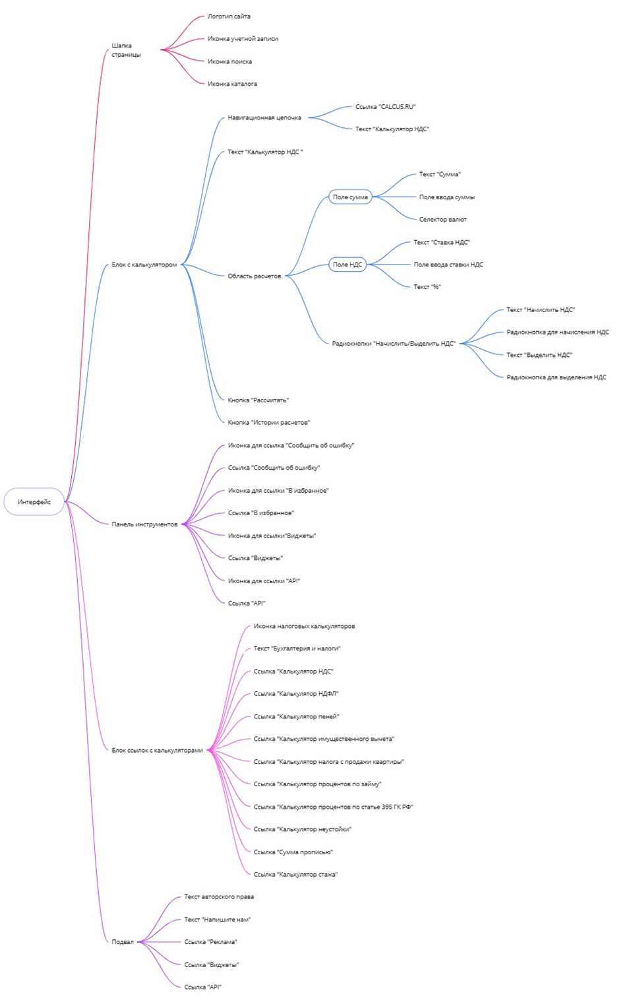
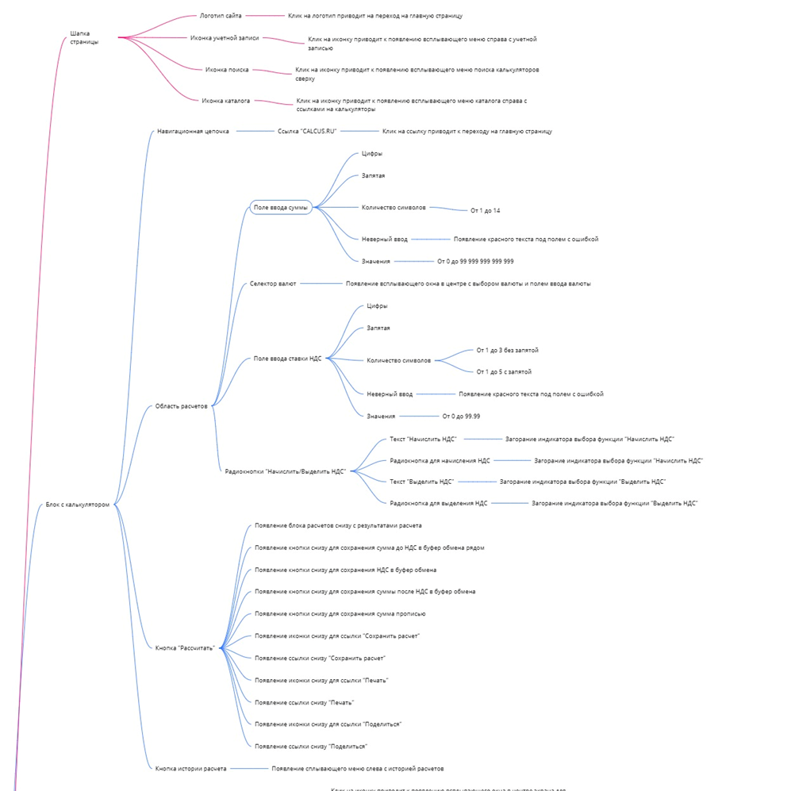
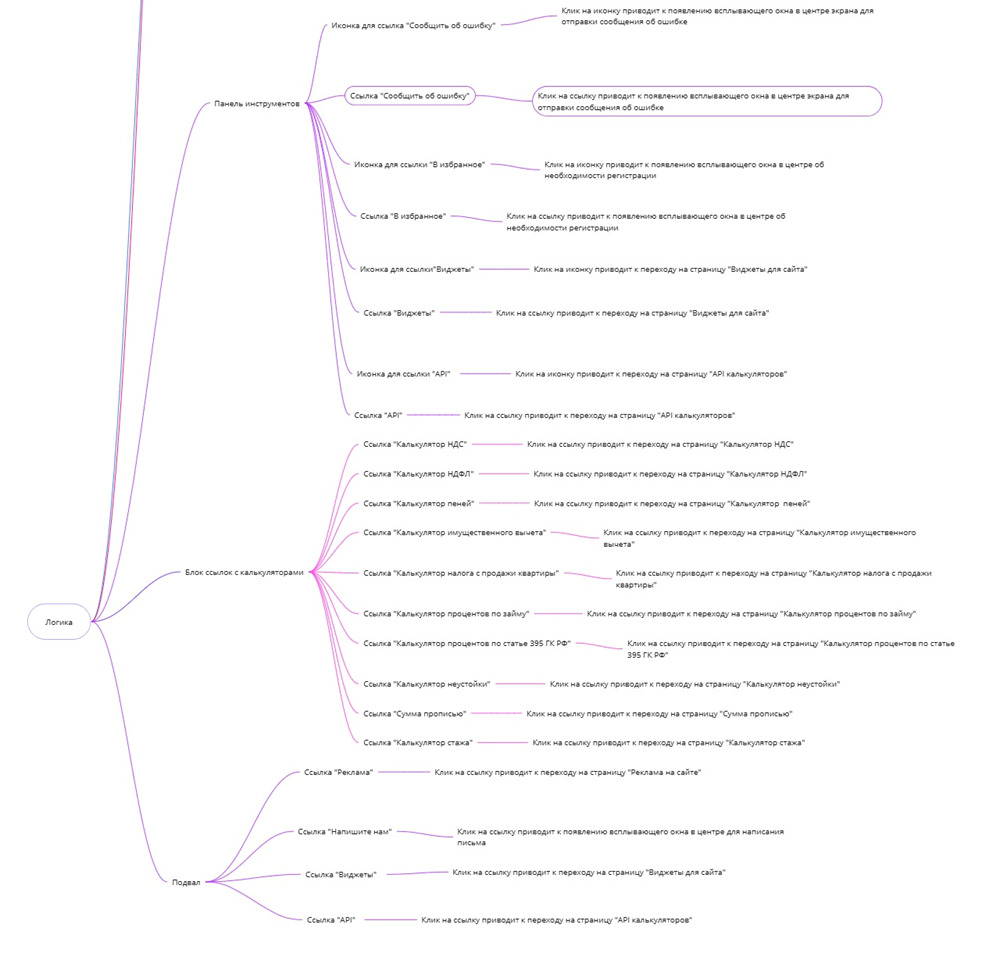

# Диаграмма связей

Автор: Ликонцев Николай

## Задачи
- Выбрать ресурс (сайт) над которым будут происходить дальнейшие лабораторные работы
- Визуализировать декомпозицию связей элементов интерфейса
- Описать логику взаимодействия 

## Задача 1
Выбор ресурса зависит от категории, которую выбрал преподавать и списком доступных сайтов. Для меня был предоставлен сайт с калькулятором

## Задача 2
Для визуализации декомпозиции можно выбрать любой ресурс, который способен отобразить все. Например,
- Miro
- Drawio

Диаграмма декомпозиции

## Задача 3
Как и для задачи 2, ресурс, с помощью которого отображается схема произвольна. Данная диаграмма разеделена на несколько изображений, так как использование одного общего изображение портится из-за размера изображения.

Диаграмма взаимодействия

