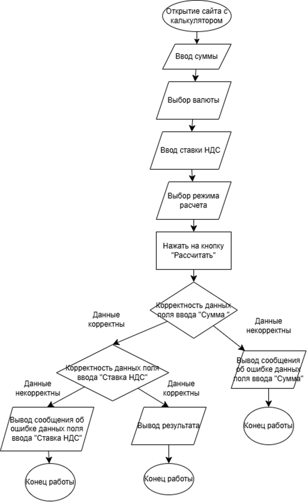

# Тест-кейсы

Автор: Ликонцев Николай

## Задачи
1. Нарисовать 1 блок-схему процесса расчета в калькуляторе.
2. Написать 3 тест-кейса. В тест-кейс поместить процессы, которые состоят из нескольких шагов. 1 из тест-кейсов на основе блок-схемы из задачи 1

## Задача 1
Ресурс, с помощью которого можно изобразить блок-схему можно выбрать произвольный. 

Блок-схема процесса расчета

## Задача 2
Написание тест кейсов удобней организовать в таск-менеджере, но так как в данной лабораторной работе не нужно использовать его, то используем обычный текстовый редактор.

Тест кейс 1: Проверка корректного расчета начисления НДС при вводе валидных данных
ID: TC-01
Заголовок: Проверка корректного расчета начисления НДС по вводу валидных данных

Предусловие:
- Пользователь открыл сайт калькулятора
Шаги:
1.	Ввести данные в поле ввода суммы:
-	Сумма: 10000
2.	Ввести данные в поле ввода ставка НДС
-	Ставка НДС: 12
3.	Нажать на радиокнопку «Начислить НДС»
4.	Нажать кнопку "Рассчитать".

Ожидаемый результат (ОР):

Система отображает результат расчета:
- Сумма до НДС
- 10 000  ₽
 
- НДС
- 1 200  ₽
 
- Сумма после НДС
- 11 200  ₽
 
- Сумма прописью
- 11 200,00 рублей (одиннадцать тысяч двести рублей 00 копеек), в том числе НДС 1 200,00 рублей (одна тысяча двести рублей 00 копеек) 

Тест кейс 2: Проверка ошибки расчета начисления НДС при вводе спецсимвола «-» в поле ввода «Сумма»
ID: TC-02
Заголовок: Проверка ошибки расчета начисления НДС по вводу спецсимвола «-» в поле ввода «Сумма»
Предусловие:
1.	Пользователь открыл сайт калькулятора
Шаги:
1.	Ввести данные в поле ввода суммы:
-	Сумма: -
2.	Ввести данные в поле ввода ставка НДС
-	Ставка НДС: 12
3.	Нажать на радиокнопку «Начислить НДС»
4.	Нажать кнопку "Рассчитать".

Ожидаемый результат (ОР):
- Обводка красным цветом поля ввода суммы с появлением текста «Обязательное поле» снизу поля ввода суммы 

Тест кейс 3: Проверка ошибки расчета начисления НДС при вводе спецсимвола «-» в поле ввода «Ставка НДС»
ID: TC-02
Заголовок: Проверка процесса расчета с некорректными вводом НДС

Предусловие:
1.	Пользователь открыл сайт калькулькулятора

Шаги:
1.	Ввести данные в поле ввода суммы:
-	Сумма: 123
2.	Ввести данные в поле ввода ставка НДС
-	Ставка НДС: -
3.	Нажать кнопку "Рассчитать".

Ожидаемый результат (ОР):
- Обводка красным цветом поля ввода ставки НДС с появлением текста «Обязательное поле» снизу поля ввода суммы
