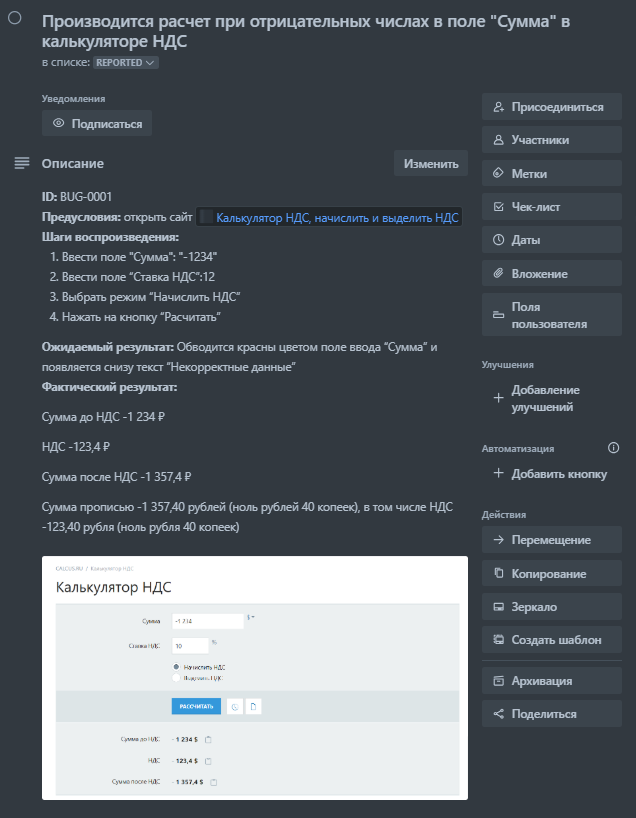
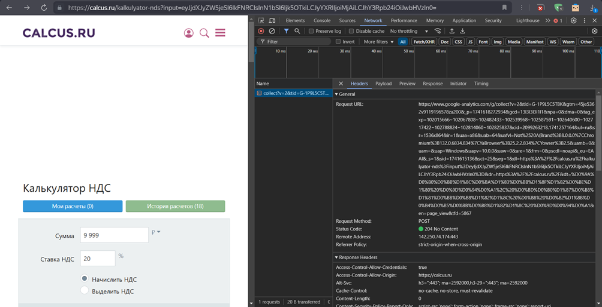
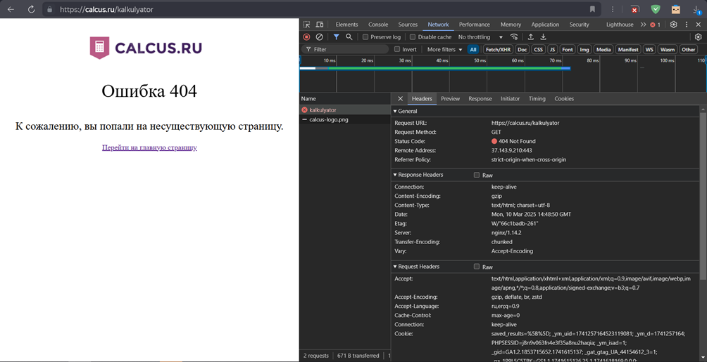
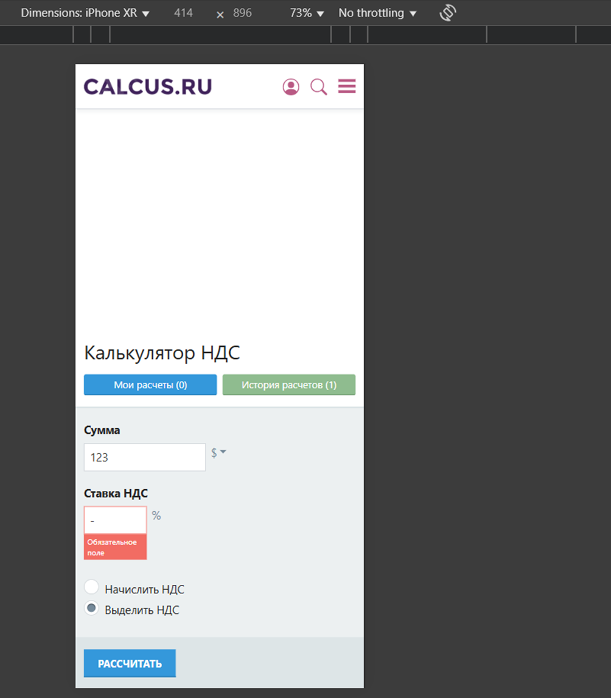

# Тестирование приложения и составление баг-репортов

Автор: Ликонцев Николай

## Задача
1. Протестировать калькулятор используя чек-лист. Создайте  баг-репорты, ссылку на баг-репорт укажите в чек листе в столбце примечание.
2. Проверить калькулятор, используя тест-кейсы. Оформить в виде таблицы, ссылки на баг-репорты в последнем столбце.
3. С помощью DevTools найти ответы сервера и сделать скрины (с кодами : ответы с ошибкой, без ошибки. С результатом расчета) 
4. С помощью DevTools протестировать интерфейс для любого мобильного устройства, написать баг-репорт если необходимо. 

## Задача 1
Чек-лист используется тот, который мы создали ранее. Все ссылки из чек-листа были удалены для безопасности, однако пример оформления баг-репорта в багтрекере будет продемонстрирован. 

| №  | Проверка                                                                 | Статус   | Баг-репорт |
|----|--------------------------------------------------------------------------|----------|------------|
| **Шапка страницы**                                                          |          |            |
| 1  | Проверить, что сайт открывается и доступен                              | PASSED   |            |
| **Шапка**                                                                  |          |            |
| 2  | Проверить, что нажатие на логотип переводит на главную страницу        | PASSED   |            |
| 3  | Проверить, что при нажатии на иконку пользователя открывается окно "Учетная запись" (справа) | PASSED |            |
| 4  | Проверить, что при нажатии на иконку поиска открывается окно "Поиск" (сверху) | PASSED |            |
| 5  | Проверить, что при нажатии на иконку каталога открывается меню "Каталог" (слева) | PASSED |            |
| **Хлебные крошки**                                                         |          |            |
| 6  | Проверить, что при наведении на "CALCUS.RU" они становятся ярче        | PASSED   |            |
| 7  | Проверить, что при нажатии на "CALCUS.RU" происходит переход на главную | PASSED   |            |
| **Блок калькулятора**                                                      |          |            |
| 8  | Проверить, что нельзя вводить отрицательные целые числа в "Сумма"      | FAILED   | №1234      |
| 9  | Проверить, что нельзя вводить отрицательные дробные числа в "Сумма"    | FAILED   | №1234      |
| 10 | Проверить, что нельзя вводить спецсимвол "-" в "Сумма"                 | FAILED   | №1235      |
| 11 | Проверить, что при нажатии на селектор валют появляется окно выбора    | PASSED   |            |
| 12 | Проверить, что нельзя вводить отрицательные целые числа в "Ставка НДС" | FAILED   | №1236      |
| 13 | Проверить, что нельзя вводить отрицательные дробные числа в "Ставка НДС" | FAILED | №1236      |
| 14 | Проверить, что нельзя вводить спецсимвол "-" в "Ставка НДС"            | FAILED   | №1237      |
| 15 | Проверить, что по умолчанию выбрано "Начислить НДС"                    | PASSED   |            |
| 16 | Проверить, что при выборе "Выделить НДС" переключается радиокнопка      | PASSED   |            |
| 17 | Проверить, что при наведении на "Рассчитать" кнопка становится ярче    | PASSED   |            |
| 18 | Проверить, что при наведении на "История расчетов" появляется подсказка | PASSED   |            |
| **Блок под калькулятором**                                                 |          |            |
| 19 | Проверить, что при нажатии на "История расчетов" открывается меню (слева) | PASSED |            |
| 20 | Проверить, что при нажатии на "Сообщить об ошибке" открывается окно     | PASSED   |            |
| 21 | Проверить, что появляется окно о необходимости авторизации              | PASSED   |            |
| 22 | Проверить, что при нажатии на "Виджеты" переход на /widget/VAT         | PASSED   |            |
| 23 | Проверить, что при нажатии на "API" переход на /api                    | PASSED   |            |
| **Подвал**                                                                 |          |            |
| 24 | Проверить, что в подвале есть юридическая сноска                        | PASSED   |            |
| 25 | Проверить, что при наведении на "Написать нам" исчезает подчеркивание  | PASSED   |            |
| 26 | Проверить, что при нажатии на "Написать нам" открывается окно          | PASSED   |            |
| 27 | Проверить, что при наведении на "Виджеты" исчезает подчеркивание       | PASSED   |            |
| 28 | Проверить, что при нажатии на "Виджеты" переход на /widget/VAT         | PASSED   |            |
| 29 | Проверить, что при наведении на "API" исчезает подчеркивание           | PASSED   |            |
| 30 | Проверить, что при нажатии на "API" переход на /api                    | PASSED   |            |
| 31 | Проверить, что при наведении на "Реклама" исчезает подчеркивание      | PASSED   |            |
| 32 | Проверить, что при нажатии на "Реклама" переход на /advert             | PASSED   |            |

Продемонстрируем пример оформления баг-репорта. В качестве баг-трекера использовалось Trello. В Trello имеется шаблон, который позволяет удобно оформить баг.

## Задача 2

| Идентификатор тест-кейса | Заголовок тест-кейса                                           | Предусловия                                               | Номер шага | Описание шага                                | Ожидаемый результат                                                                                                                                                                                                 | Окружение                                                                               | Статус      | Ссылка на баг-репорт |
|--------------------------|----------------------------------------------------------------|-----------------------------------------------------------|------------|----------------------------------------------|---------------------------------------------------------------------------------------------------------------------------------------------------------------------------------------------------------------------|-----------------------------------------------------------------------------------------|-------------|----------------------|
| TC-1                     | Проверка корректного расчета начисления НДС при вводе валидных данных | Пользователь открыл сайт  | 1          | Ввести данные в поле ввода суммы: 10000      | Сумма до НДС: 10 000 ₽ НДС: 1 200 ₽ Сумма после НДС: 11 200 ₽ Сумма прописью: 11 200,00 рублей (одиннадцать тысяч двести рублей 00 копеек), в том числе НДС 1 200,00 рублей (одна тысяча двести рублей 00 копеек) | Mozilla/5.0 (Windows NT 10.0; Win64; x64) AppleWebKit/537.36 (KHTML, like Gecko) **Chrome/120.0.0.0** Safari/537.36 | PASSED      |                      |
|                          |                                                                |                                                           | 2          | Ввести данные в поле ввода ставка НДС: 12    |                                                                                                                                                                                                                     |                                                                                         |             |                      |
|                          |                                                                |                                                           | 3          | Нажать на радиокнопку «Начислить НДС»        |                                                                                                                                                                                                                     |                                                                                         |             |                      |
|                          |                                                                |                                                           | 4          | Нажать кнопку "Рассчитать"                   |                                                                                                                                                                                                                     |                                                                                         |             |                      |
| TC-2                     | Проверка ошибки расчета начисления НДС при вводе спецсимвола «-» в поле ввода «Сумма» | Пользователь открыл сайт  | 1          | Ввести данные в поле ввода суммы: -          | Обводка красным цветом поля ввода суммы с появлением текста «Обязательное поле» снизу поля ввода суммы                                                                                                               | Mozilla/5.0 (Windows NT 10.0; Win64; x64) AppleWebKit/537.36 (KHTML, like Gecko) **Firefox/122.0** | PASSED      |                      |
|                          |                                                                |                                                           | 2          | Ввести данные в поле ввода ставка НДС: 12    |                                                                                                                                                                                                                     |                                                                                         |             |                      |
|                          |                                                                |                                                           | 3          | Нажать на радиокнопку «Начислить НДС»        |                                                                                                                                                                                                                     |                                                                                         |             |                      |
|                          |                                                                |                                                           | 4          | Нажать кнопку "Рассчитать"                   |                                                                                                                                                                                                                     |                                                                                         |             |                      |
| TC-3                     | Проверка ошибки расчета начисления НДС при вводе спецсимвола «-» в поле ввода «Ставка НДС» | Пользователь открыл сайт | 1          | Ввести данные в поле ввода суммы: 12         | Обводка красным цветом поля ввода ставки НДС с появлением текста «Обязательное поле» снизу поля ввода суммы                                                                                                          | Mozilla/5.0 (Windows NT 10.0; Win64; x64) AppleWebKit/537.36 (KHTML, like Gecko) **Edge/120.0.0.0** Safari/537.36 | PASSED      |                      |
|                          |                                                                |                                                           | 2          | Ввести данные в поле ввода ставка НДС: -     |                                                                                                                                                                                                                     |                                                                                         |             |                      |
|                          |                                                                |                                                           | 3          | Нажать на радиокнопку «Начислить НДС»        |                                                                                                                                                                                                                     |                                                                                         |             |                      |
|                          |                                                                |                                                           | 4          | Нажать кнопку "Рассчитать"                   |                                                                                                                                                                                                                     |                                                                                         |             |                      |

## Задача 3
Для того, чтобы посмотреть ответ с сайта нужно выполнить следующие действия:
1) Откройте DevTools:
- F12 или Ctrl+Shift+I (Windows/Linux)
- Cmd+Opt+I (Mac)
2) Перейдите во вкладку Network
3) Обновите страницу (F5)
4) Выберите любой запрос в списке
5) Во вкладке Headers найдите:
- Status Code

Пример демонстрации корректного ответа с сайта

Пример кода ошибки.

## Задача 4
Эмулирование устройство можно выполнить в браузере. Для это требутся сделать следующее:
1) Откройте DevTools:
- F12 или Ctrl+Shift+I (Windows/Linux)
- Cmd+Opt+I (Mac)
2) Активируйте режим мобильного устройства:
3) Нажмите иконку Toggle Device Toolbar (📱) или Ctrl+Shift+M / Cmd+Opt+M
4) В верхней панели выберите модель (iPhone, Pixel и др.) или задайте кастомные размеры

Эмулированное устройство: iPhone XR
