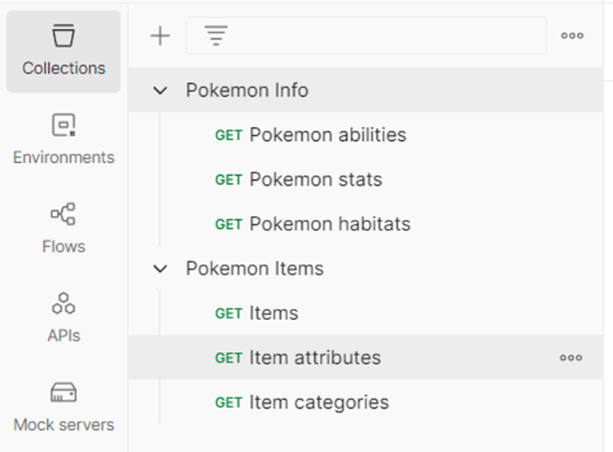
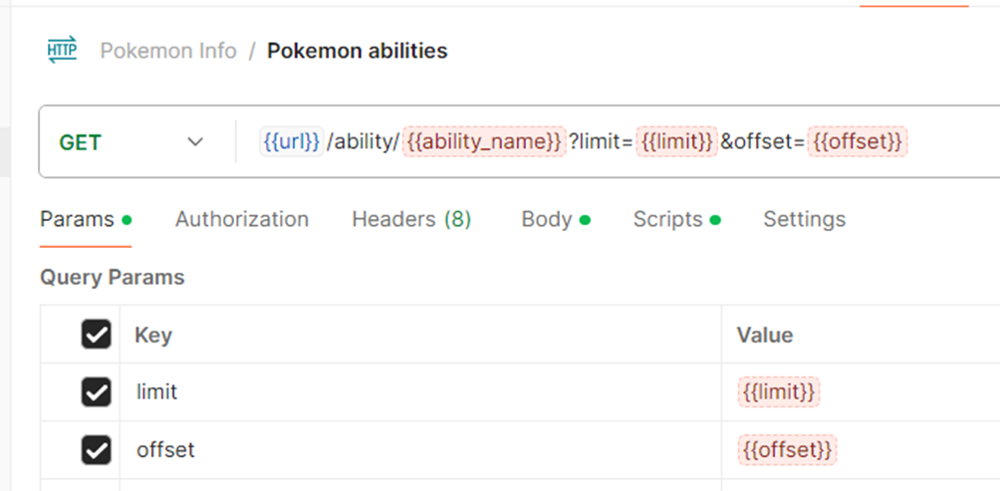
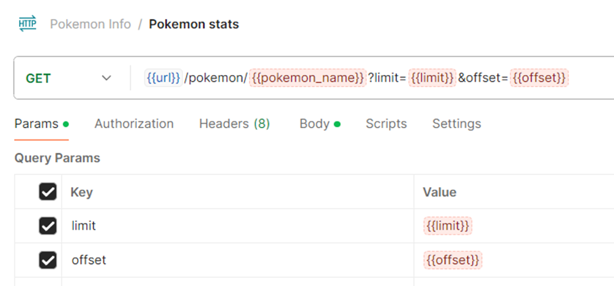
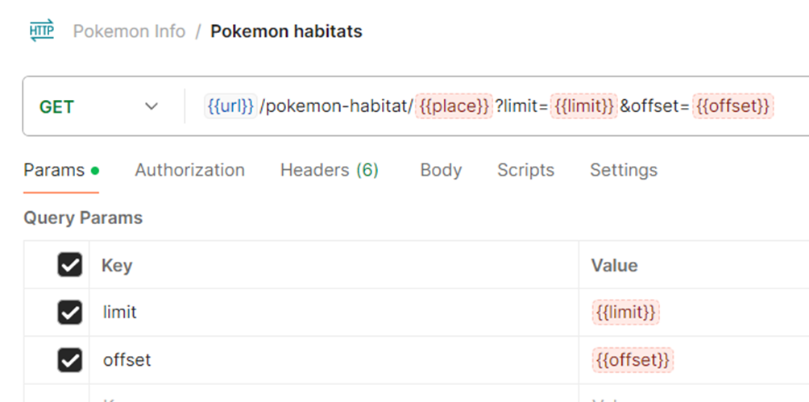
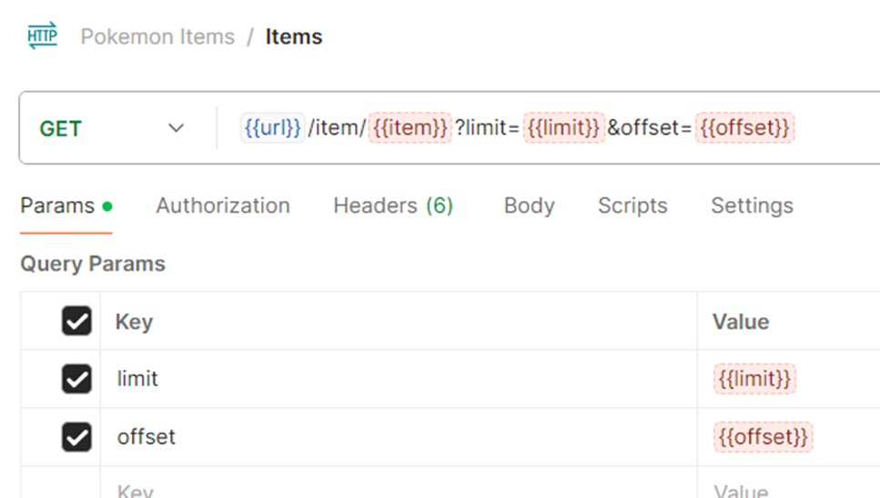
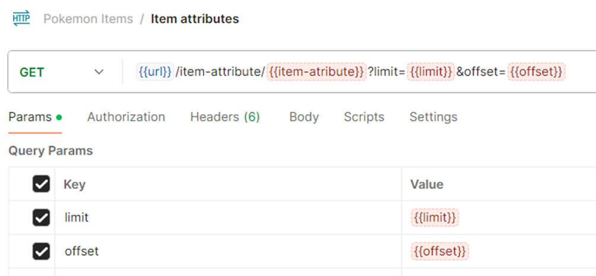
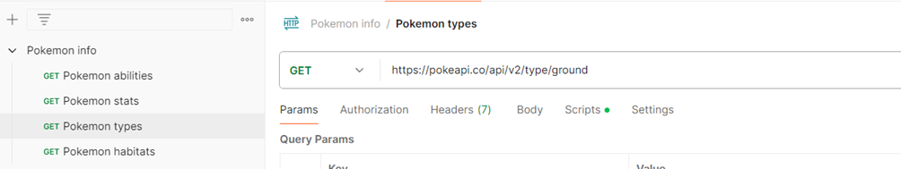
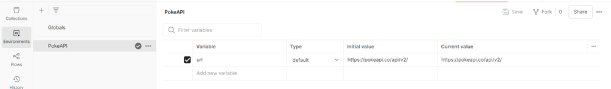
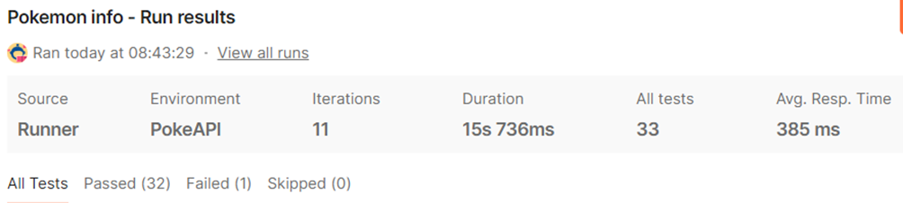
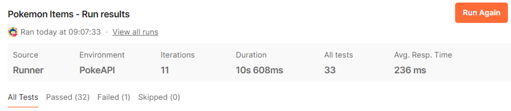

# Тест-кейсы


Автор: Ликонцев Николай


## Задачи
1. Найти любое открытое API.
2. Создать 2 коллекции в Postman (минимум 3 теста в каждой).
3. Создать окружение.
4. Провести тестирование с использованием данных из файла.

## Задание 1.
В качестве API был выбран PokeAPI (hXXps[:]//pokeapi[.]co/)

## Задание 2.
Были созданы 2 коллекции в Postman: Pokemon info и Pokemon items. Каждая коллекция содержит 3 теста.



Содержание каждого теста:

Коллекция: Pokemon Info

Тест: Pokemon abilities

Содержание: {{url}}/ability/{{ability_name}}?limit={{limit}}&offset={{offset}}



--- 

Коллекция: Pokemon Info

Тест: Pokemon stats

Содержание: {{url}}/pokemon/{{pokemon_name}}?limit={{limit}}&offset={{offset}}

 
---

Коллекция: Pokemon Info

Тест: Pokemon habitats

Содержание: {{url}}/pokemon-habitat/{{place}}?limit={{limit}}&offset={{offset}}

 
---

Коллекция: Pokemon items

Тест: Items

Содержание: {{url}}/item/{{item}}?limit={{limit}}&offset={{offset}}


---

Коллекция: Pokemon items

Тест: Item attributes

Содержание: {{url}}/item-attribute/{{item-atribute}}?limit={{limit}}&offset={{offset}}



Дополнительно (на лабораторной работе) был добавлен тест «Pokemon type»

Содержание: https://pokeapi.co/api/v2/type/ground

Для преобразования теста в более универсальный требуется заменить текущий тест на ```{{url}}/type/ground}}?limit={{limit}}&offset={{offset}}``` и изменить структуру тестового файла.

Так как этого не требовалось для демонстрации работы для «type», он остается таким.


---

Коллекция: Pokemon items

Тест: Item categories

Содержание: {{url}}/item-category/{{item-category}}?limit={{limit}}&offset={{offset}}

---

### Задание 3.
Было создано окружение «PokeAPI», который содержит в себе параметр url со стандартным значением «https://pokeapi.co/api/v2/» 


## Задание 4.
Был создан файл «test.csv», который содержит следующее:

```
ability_name,pokemon_name,place,item,item-atribute,item-category,limit,offset
stench,bulbasaur,cave,master-ball,countable,stat-boosts,10,0
drizzle,pikachu,forest,potion,consumable,medicine,20,10
speed-boost,charizard,mountain,rare-candy,holdable,effort-drop,30,20
torrent,squirtle,waters-edge,ultra-ball,usable-in-battle,in-a-pinch,15,5
overgrow,chikorita,grassland,great-ball,holdable-active,choice,25,15
blaze,cyndaquil,mountain,lure-ball,holdable-passive,effort-training,5,0
static,raichu,forest,net-ball,countable,type-protection,12,6
chlorophyll,bayleef,grassland,dive-ball,holdable,species-specific,18,9
inner-focus,umbreon,cave,repeat-ball,holdable,event-items,8,4
synchronize,espeon,forest,timer-ball,consumable,type-enhancement,22,11
synchize,espeon,forest,timer-ball,comable,type-enhancement,22,11
```
(Файл содержится в репозитории)

Последний тест содержит ошибки для проверки корректности работы.

Каждый тест содержит проверку на статус-код:
```
pm.test("Status code is 200", function () {
    pm.response.to.have.status(200);
});
```

 
