# Тестирование приложения и составление баг-репортов


Автор: Ликонцев Николай


## Задачи
### Часть 1. Selenium IDE
1) Создать 7 тестов, включающих:
- проверку наличия и оформления элементов(не более 3х);
- проверку перехода по ссылкам;
- проверку валидации данных;
- проверку тестовых сценариев.

### Часть 2. Selenium Webdriver
1) Автоматизируйте тестирование с использование Selenium в языках программирования (Java, . Net (C#), Python, Ruby, JavaScript) Напишите 7 тестов.
2) Провести проверку наличия и оформления элементов.
3) Провести проверку переходов по ссылкам.
4) После перехода по ссылке на другую страницу, обязательно найти уникальный элемент страницы для подтверждения перехода. 
5) Провести тест полного пользовательского сценария
Необходимо в глобальном поле поиска главной страницы ввести данные в форму, найти объект(ресурс) и перейти в нем по ссылке на ресурс, с последующей проверкой, что вы перешли на тот источник, который и хотели. 

# **Часть 1. Selenium IDE**
## **Тест: «Проверка корректного расчета начисления НДС при вводе валидных данных»**

Описание: Данный тест проверяет корректность расчета начисления НДС при вводе валидных данных.

На изображении снизу отображены шаги, выполняемые в этом тесте.

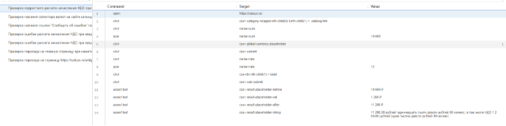

Результат теста: 

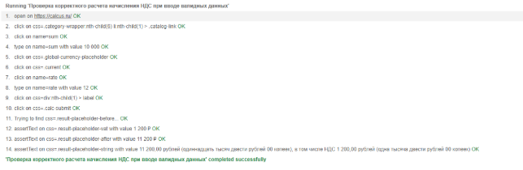

## **Тест: «Проверка наличия селектора валют на сайте калькулятор НДС»**
Описание: Данный тест проверяет наличие селектора валют на сайте «https://calcus.ru/kalkulyator-nds».

На изображении снизу отображены шаги, выполняемые в этом тесте.

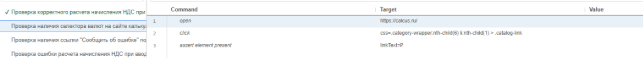

Результат теста: 

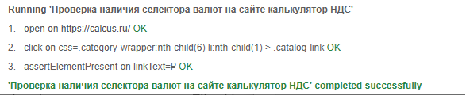

## **Тест: «Проверка наличия ссылки "Сообщить об ошибке" под блоком калькулятора»**
Описание: Данный тест проверяет наличие ссылки "Сообщить об ошибке" под блоком калькулятора.

На изображении снизу отображены шаги, выполняемые в этом тесте.

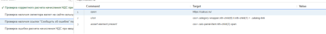

Результат теста: 

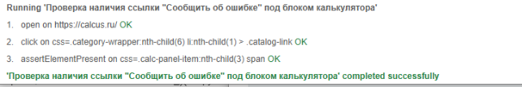

## **Тест: «Проверка ошибки расчета начисления НДС при вводе спецсимвола «-» в поле ввода «Ставка НДС»»**
Данный тест проверяет расчет начисления НДС при вводе спецсимвола «-» в поле ввода «Ставка НДС».

На изображении снизу отображены шаги, выполняемые в этом тесте.


Результат теста:

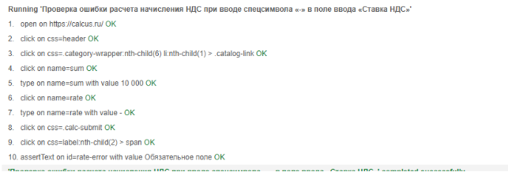

## **Тест: «Проверка ошибки расчета начисления НДС при вводе спецсимвола «-» в поле ввода «Сумма»»**
Данный тест проверяет расчет начисления НДС при вводе спецсимвола «-» в поле ввода «Сумма»»

На изображении снизу отображены шаги, выполняемые в этом тесте.

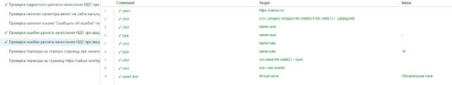

Результат теста:

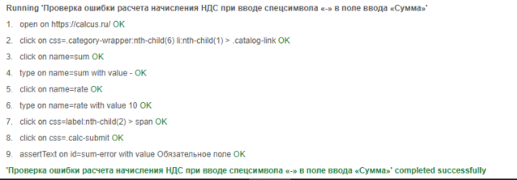

## **Тест: «Проверка перехода на главную страницу при нажатии на логотип»**
Данный тест проверяет переход на главную страницу при нажатии на логотип.

На изображении снизу отображены шаги, выполняемые в этом тесте.

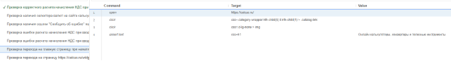

Результат теста:

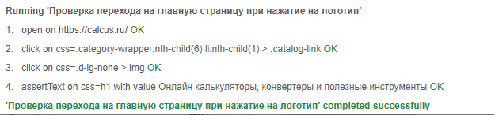

## **Тест: «Проверка перехода на страницу https://calcus.ru/widget/VAT при нажатии на ссылку "Виджет"»**
Данный тест проверяет перехода на страницу https://calcus.ru/widget/VAT при нажатии на ссылку "Виджет"

На изображении снизу отображены шаги, выполняемые в этом тесте.

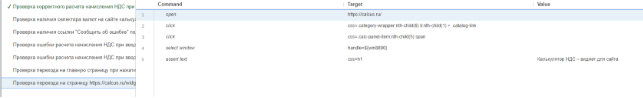

Результат теста:

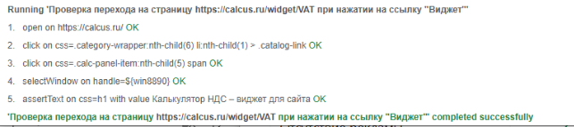


## **Подробно о коде**
Тестирование выполнено с помощью библиотеки pytest, который упрощает тестирование и его автоматизацию. Для его работы требуется установить библиотеку на устройство с помощью команды pip install pytest.

Общая структура

- Фикстура browser, которая инициализирует браузер Chrome перед тестами и закрывает его после выполнения.
- scope="module" означает, что браузер будет переиспользоваться для всех тестов в файле.

Ключевые тесты и их логика

1\. test\_error\_on\_negative\_sum

Проверяет обработку отрицательной суммы (-).

2\. test\_error\_on\_negative\_rate

Проверяет обработку отрицательной ставки НДС (-).

3\. test\_redirect\_to\_main\_page\_on\_logo\_click

Кликает на логотип и проверяет переход на главную страницу.

4\. test\_correct\_calculation\_with\_valid\_value

Проверяет корректный расчет НДС для валидных данных (сумма = 10 000, ставка = 12%).

5\. test\_check\_currency\_selector\_on\_website

Проверяет наличие селектора валют (₽) на странице.

6\. test\_error\_report\_link\_present\_under\_calculator

Проверяет наличие ссылки "Сообщить об ошибке" под калькулятором.

7\. test\_redirect\_to\_widget\_page\_on\_link\_widget

Кликает на ссылку "Виджет", переключается на новое окно и проверяет заголовок h1.

🔹 Общие паттерны в коде


```python
try:
    # 1. Открытие страницы и прокрутка к элементу
    browser.get("https://calcus.ru/")
    category_element = WebDriverWait(browser, 10).until(
        EC.presence_of_element_located((By.CSS_SELECTOR, "селектор_элемента"))
    )
    browser.execute_script("arguments[0].scrollIntoView();", category_element)

    # 2. Выполнение действий через ActionChains
    actions = ActionChains(browser)
    actions.move_to_element(element).click().perform()

    # 3. Проверки с явными ожиданиями
    result_element = WebDriverWait(browser, 10).until(
        EC.visibility_of_element_located((By.XPATH, "xpath_элемента"))
    )
    assert result_element.text == "Ожидаемый текст", f"Фактический текст: {result_element.text}"
    
    print("✅ Успех")
except Exception as e:
    print(f"❌ Ошибка: {str(e)}")
    raise
```

### Ключевые компоненты:

1. **Инициализация браузера и навигация**:
```python
browser.get("https://example.com")
```

2. **Ожидание элементов**:
```python
element = WebDriverWait(browser, 10).until(
    EC.presence_of_element_located((By.ID, "element_id"))
)
```

3. **Действия с элементами**:
```python
ActionChains(browser).move_to_element(element).click().perform()
```

4. **Проверки**:
```python
assert element.text == "Expected Text", f"Ошибка: {element.text}"
```

5. **Обработка ошибок**:
```python
try:
    # тестовый код
except Exception as e:
    print(f"❌ Тест упал: {e}")
    raise
```