# Чек-лист

Автор: Ликонцев Николай

## Задачи
1) Установить вспомогательные ресурсы, требуемые для корректной работы утилиты
2) Установить утилиты
3) Добавить Thread Group 
4) Добавить элементы JMeter
    - Добавить HTTP Request Defaults
    - Добавить HTTP Request
    - Добавить Graph Result
5) Реализовать нагрузочное тестирование

## Задачи 1-2
Перед началом работы требуется установить требуемые ресурсы.

Был скачан бинарный файл «JMeter»с с официального сайта JMeter.
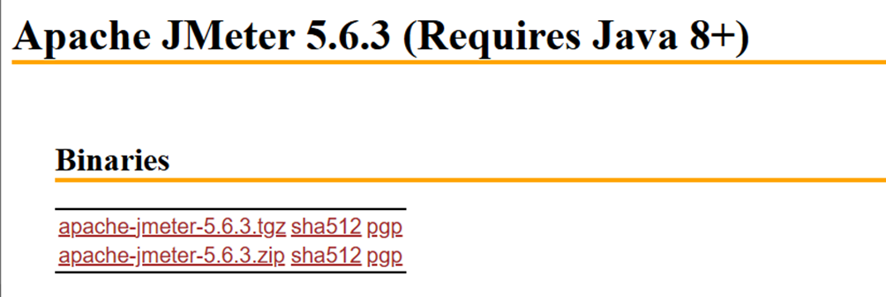
 
После этого был установлен Java с официального ресурса.
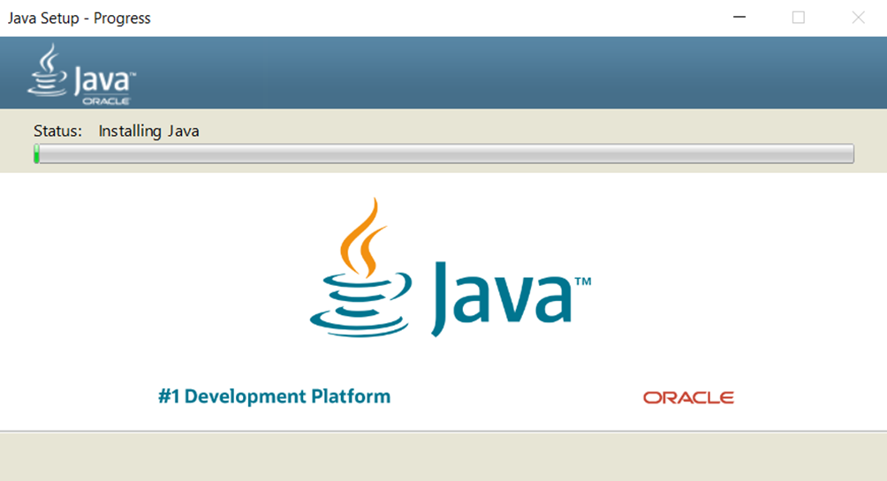

После разархивирования архива с JMeter и установки Java, мы запускаем JMeter.
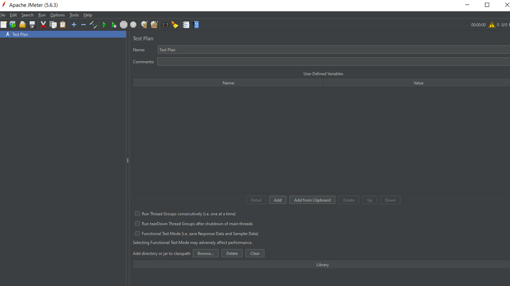

После установки менеджера плагонов, мы устанавливаем нужные плагины.
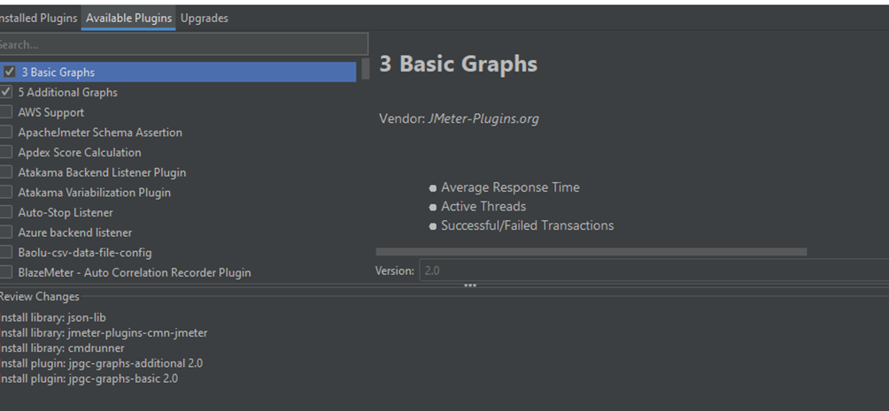

После применении настроек и перезагрузки утилита готова к работе.

## Задача 3 
Для начала добавим новую группу потоков. Для этого 
1)	Кликните правой кнопкой мыши на Test Plan в дереве проекта JMeter.
2)	В контекстном меню выберите: Add → Threads (Users) → Thread Group
После этого мы увидим на экране состояние, показанное на следующем изображении.
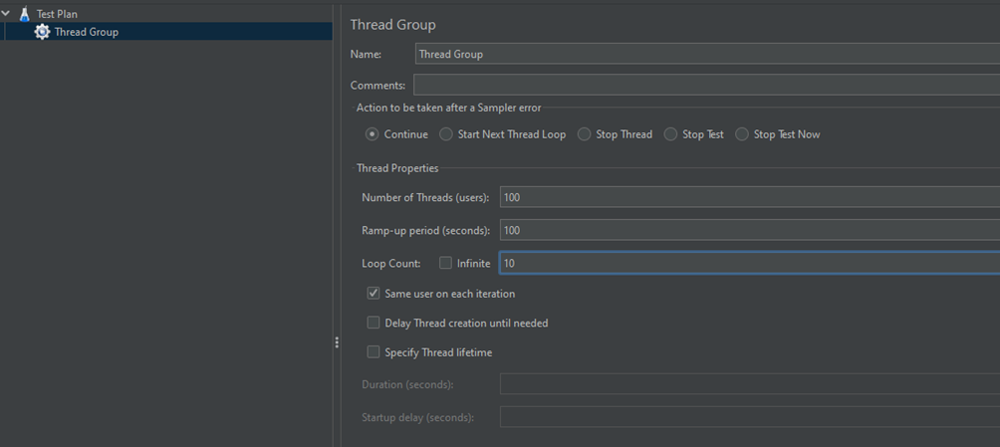
Далее, мы заполняем параметры: 
1.	Number of Threads (users) → 100
2.	Loop Count → 10
3.	Ramp-Up Period (seconds) → 100
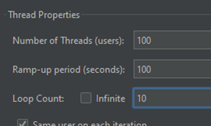
## Задача 4
### Добавление HTTP Request Defaults
Теперь нам нужно добавить элемент HTTP Request Defaults. Для этого нужно выполнить следующие действия:
1)	Правой кнопкой мыши кликните на Thread Group в дереве теста.
2)	В контекстном меню выберите: Add → Config Element → HTTP Request Defaults
Теперь добавим адрес сайта с калькуляторами.
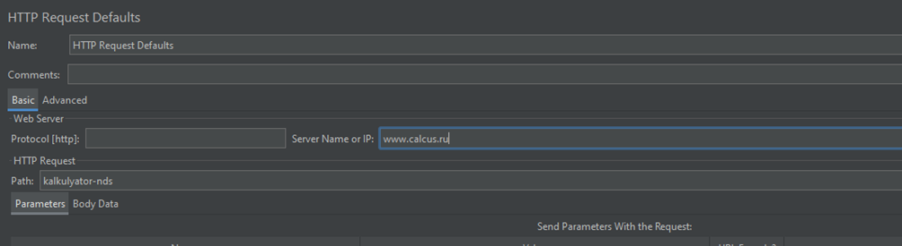

### Добавление HTTP Request
Для добавления семплера
1)	Кликаем правой кнопкой на Thread Group →Add → Sampler → HTTP Request.
2)	Это создаст новый HTTP-запрос в рамках группы потоков.
После этого заполняем параметры для запроса:

Name: Калькулятор НДС

Server Name or IP: IP-сервера

Path: kalkulyator-nds

### Добавление Graph Result
Для отображения результатов нагрузочного теста в виде графика следуем следующее:
1.	Правой кнопкой мыши кликнуть на Test Plan.
2.	В контекстном меню выбрать: Add → Listener → Graph Results

 
## Задача 5
Ниже будут представлены графики, которые были получены в результате тестирования сайта с калькулятором НДС.

Graph Results

Назначение: Общая визуализация производительности системы.
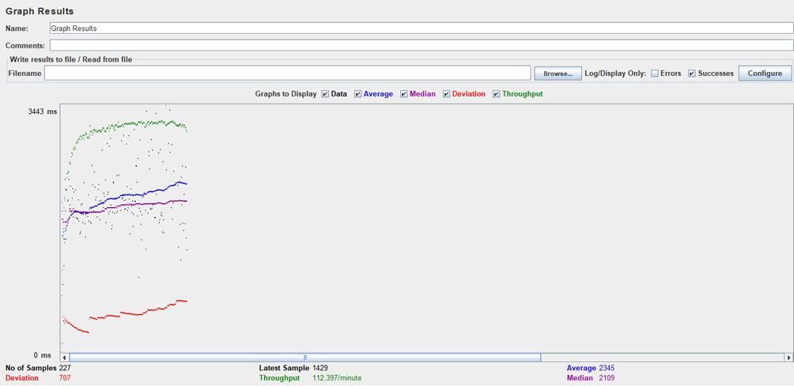

Active Threads Over Time 

Назначение: Контроль нагрузки, создаваемой виртуальными пользователями.
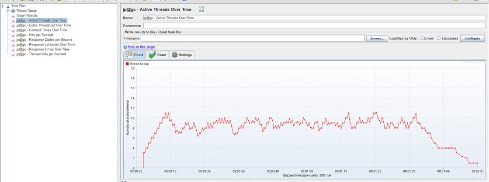

Bytes Throughput Over Time

Назначение: Оценка нагрузки на сеть.
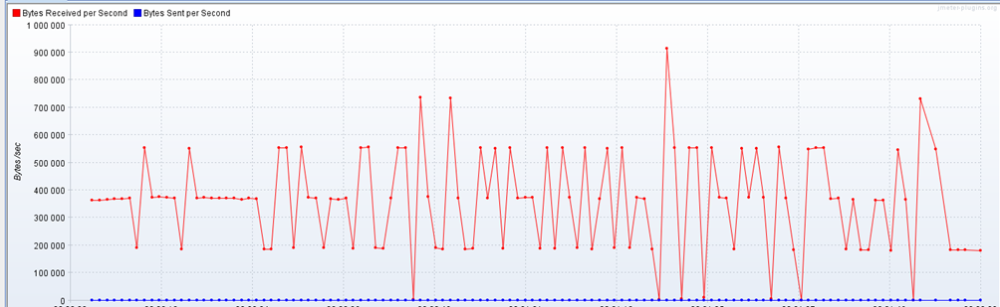

Connect Times Over Time

Назначение: Анализ сетевой задержки.

 

Hits per Second

Назначение: Интенсивность работы системы.
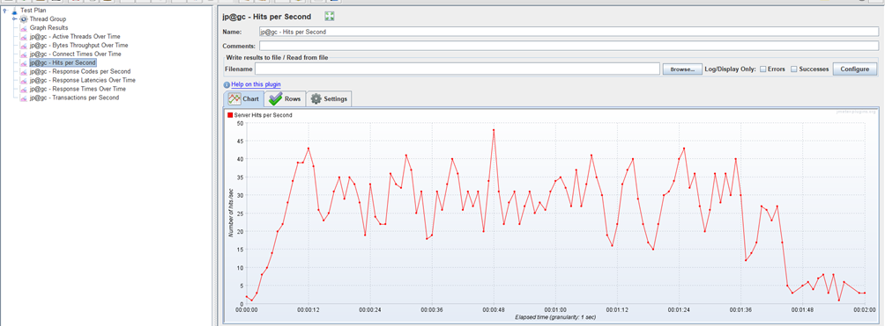

Response Codes per Second 

Назначение: Выявление ошибок.
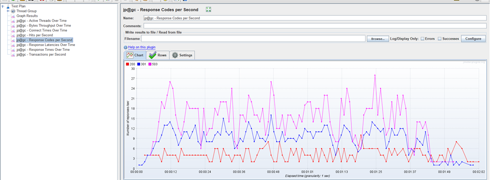
 

Response Latencies Over Time

Назначение: Время до первого байта.
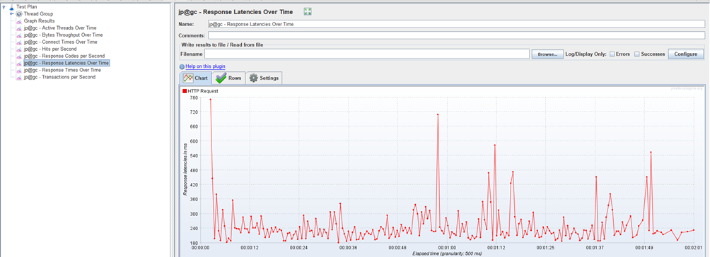

Response Times Over Time

Назначение: Основной показатель производительности.
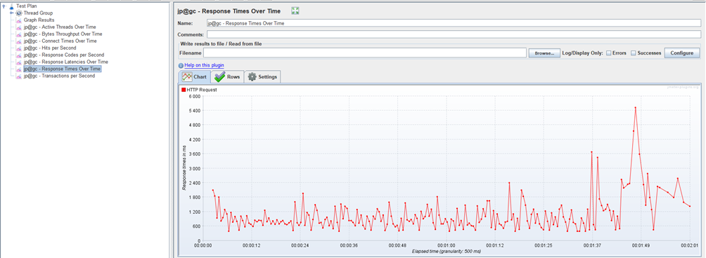

Transactions per Second

Назначение: Эффективность обработки бизнес-логики.
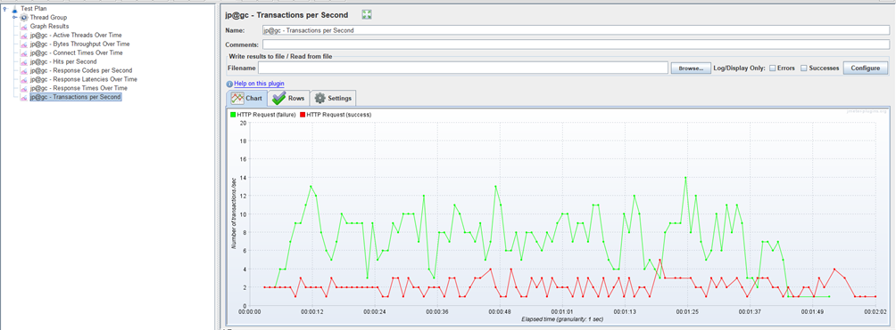

